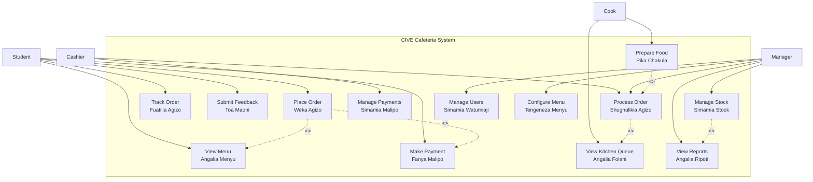

# CIVE Cafeteria Management System - Use Case Diagram

## 4. Use Case Diagram (Mchoro wa Matumizi)

### 4.1 System Use Case Diagram



### 4.2 Detailed Use Case Diagram by Module

#### 4.2.1 Student Module (Moduli ya Wanafunzi)
```
┌─────────────────────────────────────────────────────────────────────┐
│                     STUDENT USE CASES                                │
│                  (Matumizi ya Wanafunzi)                           │
├─────────────────────────────────────────────────────────────────────┤
│                                                                     │
│   ┌──────────────┐                                                 │
│   │   STUDENT    │                                                 │
│   │  (Mwanafunzi)│                                                 │
│   └──────┬───────┘                                                 │
│          │                                                          │
│          ├──► (UC-001) View Menu ──────► ┌────────────────────┐    │
│          │         (Angalia Menyu)        │ Display Food Items│    │
│          │                               │ Show Prices        │    │
│          │                               │ Show Stock Status  │    │
│          │                               └────────────────────┘    │
│          │                                                          │
│          ├──► (UC-002) Place Order ────► ┌────────────────────┐    │
│          │        (Weka Agizo)          │ Select Items       │    │
│          │                               │ Calculate Total    │    │
│          │                               │ Enter Details      │    │
│          │                               └────────────────────┘    │
│          │                                                          │
│          ├──► (UC-003) Make Payment ───► ┌────────────────────┐    │
│          │        (Fanya Malipo)        │ Choose Method      │    │
│          │                               │ Process Payment    │    │
│          │                               └────────────────────┘    │
│          │                                                          │
│          ├──► (UC-004) Track Order ────► ┌────────────────────┐    │
│          │     (Fuatilia Agizo)         │ View Status        │    │
│          │                               │ See Queue Position │    │
│          │                               │ View Wait Time     │    │
│          │                               └────────────────────┘    │
│          │                                                          │
│          └──► (UC-005) Give Feedback ────► ┌────────────────────┐    │
│                 (Toa Maoni)              │ Rate Experience    │    │
│                                          │ Write Comments     │    │
│                                          └────────────────────┘    │
│                                                                     │
└─────────────────────────────────────────────────────────────────────┘
```

#### 4.2.2 Staff Module (Moduli ya Wafanyakazi)
```
┌─────────────────────────────────────────────────────────────────────┐
│                     STAFF USE CASES                                  │
│                 (Matumizi ya Wafanyakazi)                          │
├─────────────────────────────────────────────────────────────────────┤
│                                                                     │
│   ┌──────────────┐      ┌──────────────┐      ┌──────────────┐     │
│   │   CASHIER    │      │    COOK      │      │   MANAGER    │     │
│   │(Mhudumu Fedha)│     │   (Mpishi)   │      │ (Msimamizi)  │     │
│   └──────┬───────┘      └──────┬───────┘      └──────┬───────┘     │
│          │                     │                     │              │
│          ▼                     ▼                     ▼              │
│   ┌─────────────┐       ┌─────────────┐       ┌─────────────┐     │
│   │View Orders  │       │View Queue   │       │View Dashboard│     │
│   │Process Order│       │Mark Started │       │Manage Stock │     │
│   │Accept Pay   │       │Mark Ready   │       │View Reports │     │
│   │Cancel Order │       │View Stock   │       │Manage Users │     │
│   └─────────────┘       └─────────────┘       │Configure    │     │
│                                               └─────────────┘     │
│                                                                     │
└─────────────────────────────────────────────────────────────────────┘
```

### 4.3 Use Case Relationships (Uhusiano wa Matumizi)

```
┌─────────────────────────────────────────────────────────────────────┐
│                    USE CASE RELATIONSHIPS                            │
│                 (Uhusiano wa Matumizi)                             │
├─────────────────────────────────────────────────────────────────────┤
│                                                                     │
│  INCLUDE (Lazima)                    EXTEND (Kiendelezi)           │
│  ━━━━━━━━━━━━━━━━━━━                 ━━━━━━━━━━━━━━━━━━━           │
│                                                                     │
│  ┌───────────────┐                   ┌───────────────┐             │
│  │ Place Order   │◄──────────────────│ View Menu     │             │
│  │ (Weka Agizo)  │    <<include>>    │ (Angalia      │             │
│  └───────────────┘                   │  Menyu)       │             │
│          │                           └───────────────┘             │
│          │ MUST include menu                                      │
│          │ viewing before order                                   │
│          ▼                                                         │
│  ┌───────────────┐                   ┌───────────────┐             │
│  │ Make Payment  │◄──────────────────│ Cash Pay      │             │
│  │ (Fanya Malipo)│    <<include>>    │ (Lipa Cash)   │             │
│  └───────────────┘                   │               │             │
│          │                           └───────────────┘             │
│          │ MUST have payment                                      │
│          │ for order completion                                   │
│          ▼                                                         │
│  ┌───────────────┐                   ┌───────────────┐             │
│  │ Process Order │◄──────────────────│ Cancel Order  │             │
│  │(Shughulikia  │    <<include>>    │ (Ghairi      │             │
│  │   Agizo)      │                   │   Agizo)     │ <<extend>>  │
│  └───────────────┘                   └───────────────┘             │
│                                       Optional extension           │
│                                                                     │
└─────────────────────────────────────────────────────────────────────┘
```

### 4.4 Complete System Use Case List

| ID | Use Case | Actor | Description |
|----|----------|-------|-------------|
| UC-001 | View Menu | Student | Browse available food items with prices and stock status |
| UC-002 | Place Order | Student | Select items, calculate total, submit order |
| UC-003 | Make Payment | Student | Pay using cash, M-Pesa, Tigo Pesa, or Airtel Money |
| UC-004 | Track Order | Student | Check order status and estimated waiting time |
| UC-005 | Submit Feedback | Student | Rate experience and provide comments |
| UC-006 | Process Order | Cashier | View, accept, and manage customer orders |
| UC-007 | Manage Payments | Cashier | Record and verify payment transactions |
| UC-008 | View Kitchen Queue | Cook | See incoming orders in preparation queue |
| UC-009 | Prepare Food | Cook | Mark order as preparing and ready |
| UC-010 | Manage Stock | Manager | Add stock, set thresholds, view alerts |
| UC-011 | View Reports | Manager | Generate sales, orders, and analytics reports |
| UC-012 | Manage Users | Manager | Add, edit, and remove staff accounts |
| UC-013 | Configure Menu | Manager | Add, edit, and deactivate food items |

### 4.5 Use Case Priority Matrix

```
                    EFFORT (Juhudi)
               Low ◄─────────────────► High
           ┌─────────────────────────────┐
    High   │     UC-001 View Menu       │
           │     UC-002 Place Order     │
    ▲      │     UC-006 Process Order   │
    │      │     UC-009 Prepare Food    │
 VALUE     │                            │
(Thamani)  │  UC-003 Make Payment       │
    │      │  UC-008 Kitchen Queue      │
    ▼      │                            │
    Low    │ UC-005 Feedback     UC-013 │
           │ UC-012 User Mgmt    Config │
           └─────────────────────────────┘
           
           🟢 Quick Wins    🟡 Major Projects
           ⚪ Fill-ins       🔴 Thankless Tasks
```

---

**Document Version:** 1.0  
**Date:** June 2026
